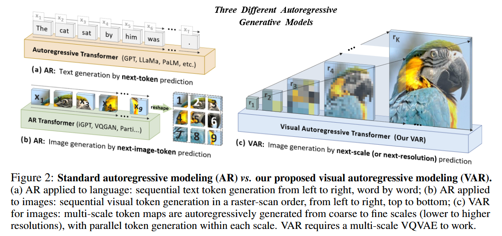
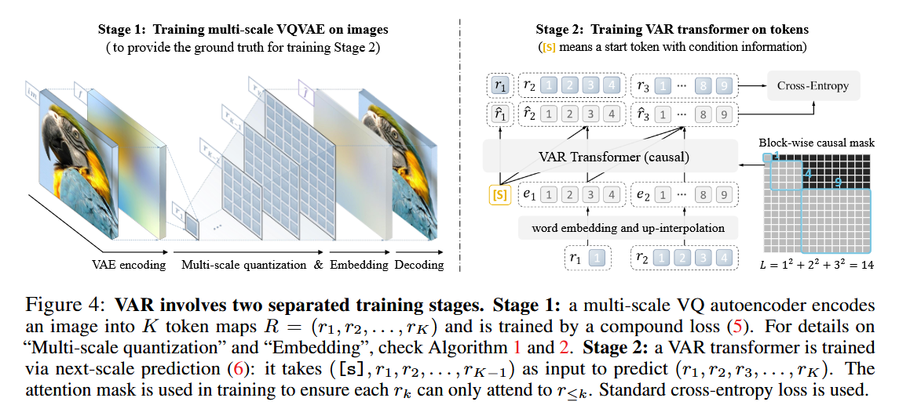

#  VAR: A New Era for Autoregressive Models in Computer Vision

The field of computer vision has been revolutionized by advancements in deep learning, particularly in the area of image generation. Generative Adversarial Networks (GANs) and diffusion models have dominated the landscape, demonstrating remarkable capabilities in synthesizing realistic images. However, another contender, **autoregressive (AR) models**, inspired by the success of large language models (LLMs) like GPT, has been steadily emerging. 

While AR models have shown promise in image generation, they have been plagued by limitations that have prevented them from reaching the performance levels of their GAN and diffusion-based counterparts. A paper presented at NeurIPS 2024, "Visual Autoregressive Modeling: Scalable Image Generation via Next-Scale Prediction," introduces **VAR**, a novel framework that addresses these limitations and unlocks the true potential of AR models in computer vision.

##  The Challenges of Traditional AR Models for Images

Traditional AR models, like those used in language processing, operate on the principle of **next-token prediction**. They generate output sequentially, one token (e.g., a word or a pixel) at a time, based on the preceding tokens. However, directly applying this approach to images presents several challenges:

- **Violation of Mathematical Premise:** Images, unlike text, have inherent bidirectional correlations between pixels. Flattening a 2D image into a 1D sequence for AR modeling disrupts these correlations and contradicts the unidirectional dependency assumption of AR models.
- **Limited Zero-Shot Generalization:** The sequential nature of traditional AR models hinders their ability to perform tasks that require bidirectional reasoning, such as predicting the top part of an image given the bottom part.
- **Structural Degradation:** Flattening a 2D image into a 1D sequence disrupts the spatial locality of pixels, leading to a loss of structural information.
- **Inefficiency:** Generating images with traditional AR models involves a quadratic number of decoding steps and a high computational cost, making it slow and resource-intensive.

##  VAR: A Paradigm Shift with Next-Scale Prediction

VAR tackles these challenges by redefining the autoregressive process for images. Instead of predicting the next token, VAR predicts the **next scale** of the image. This means that VAR generates the image hierarchically, starting from a coarse representation and progressively adding details until the full-resolution image is produced.

This **next-scale prediction** paradigm is inspired by how humans perceive and create images, focusing on the global structure before refining local details. It is also aligned with the multi-scale designs prevalent in computer vision.

###  How VAR Works

VAR involves two main stages:

1. **Training a Multi-Scale VQVAE:** This stage involves training a multi-scale Vector Quantized Variational Autoencoder (VQVAE) to encode an image into a series of multi-scale token maps. Each token map represents the image at a different resolution, with the final map matching the original resolution.
2. **Training a VAR Transformer:** A GPT-style transformer is trained to predict the next higher-resolution token map, conditioned on the previously generated maps. This process continues until the full-resolution image is generated.

##  Impressive Results and Scaling Laws

Empirical evaluations on the ImageNet benchmark demonstrate the superiority of VAR over existing image generation methods. 

- **State-of-the-Art Performance:** VAR achieves state-of-the-art results in terms of FID and IS, surpassing even diffusion transformers, the foundation of leading diffusion systems like Stable Diffusion.
- **Remarkable Speed:** VAR is significantly faster than traditional AR models, reaching speeds comparable to efficient GAN models.
- **Data Efficiency:** VAR requires fewer training epochs compared to diffusion models.
- **Scalability:** VAR exhibits clear power-law scaling laws, similar to LLMs, indicating that performance continues to improve as the model size increases.

##  Zero-Shot Generalization: Beyond Image Generation

The benefits of VAR extend beyond image generation. It also demonstrates promising zero-shot generalization capabilities in downstream tasks such as:

- **Image In-Painting and Out-Painting:** VAR can successfully fill in missing parts of an image or extend its boundaries.
- **Class-Conditional Image Editing:** VAR can modify specific regions of an image based on a given class label.

##  Future Directions and Applications

VAR represents a significant leap forward in the development of AR models for computer vision. It opens up exciting possibilities for future research and applications:

- **Text-Prompt Generation:** Integrating VAR with LLMs can enable text-to-image generation, potentially rivaling or exceeding the capabilities of current diffusion-based models.
- **Video Generation:** The next-scale prediction paradigm can be extended to video generation, addressing the challenges of temporal consistency and long-term dependencies.
- **Multi-Modal Understanding:** VAR's ability to model complex visual distributions and its compatibility with LLMs make it a promising candidate for multi-modal learning and understanding, paving the way for more advanced AI systems.

##  Conclusion

VAR heralds a new era for AR models in computer vision. By addressing the limitations of traditional approaches and demonstrating impressive performance, scalability, and generalization capabilities, VAR has established itself as a powerful tool for image generation and beyond. 

This breakthrough has the potential to reshape the landscape of computer vision, fostering closer integration with the advancements in natural language processing and contributing to the development of truly intelligent multi-modal AI systems. 
