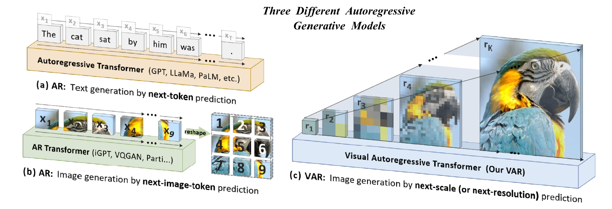
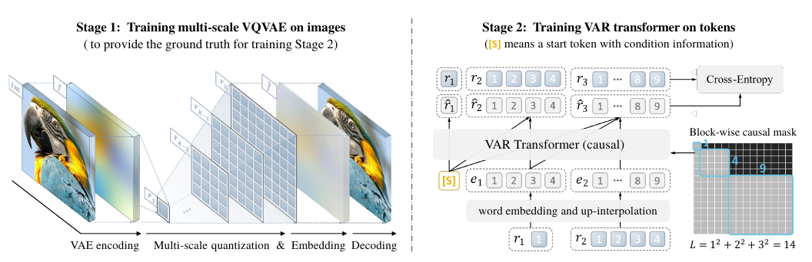
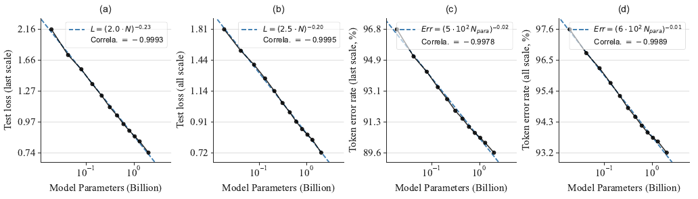
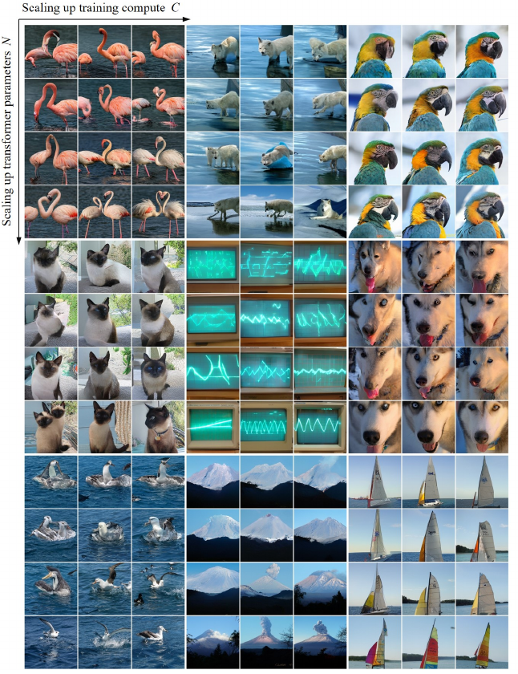
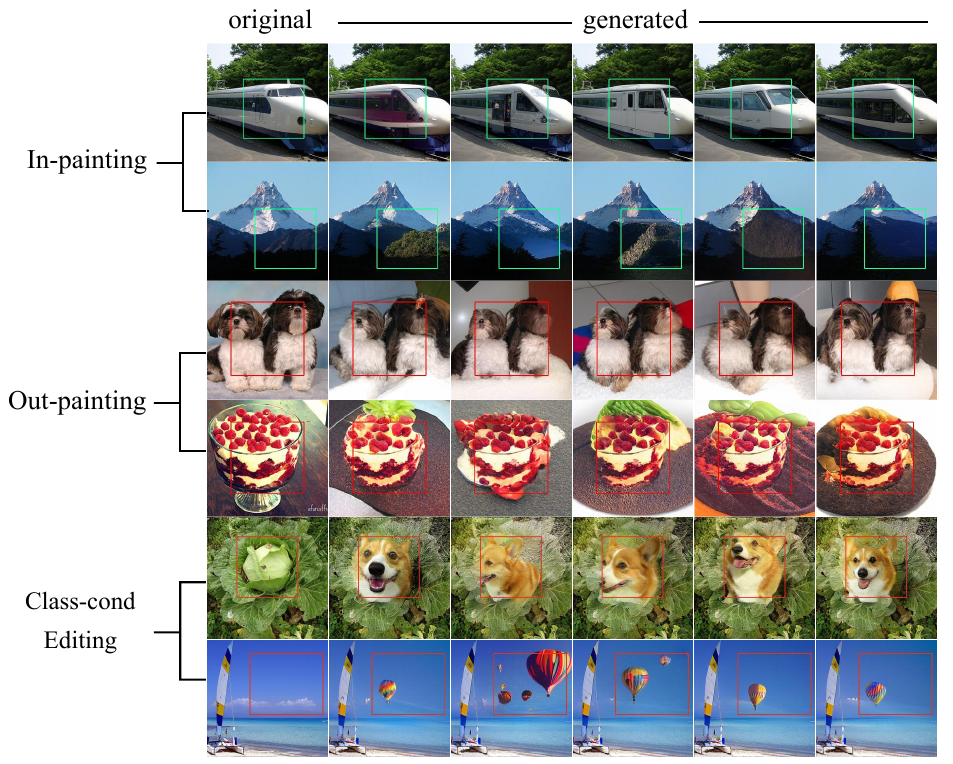

 

# Visual AutoRegressive Modeling (VAR): A New Era for Autoregressive Models to Generate Images in Computer Vision
>*This blog is written by [1905009 - Sidratul Muntaha Khan](https://github.com/Nahin009) | [1905010 - Md Muhaiminul Islam Nafi](https://github.com/nafiislam) | [1905046 - Niaz Rahman](https://github.com/1905046-NiazRahman) from CSE, BUET*

The field of computer vision has been revolutionized by advancements in deep learning, particularly in the area of image generation. Generative Adversarial Networks (GANs) and diffusion models have dominated the landscape, demonstrating remarkable capabilities in synthesizing realistic images. However, another contender, **autoregressive (AR) models**, inspired by the success of large language models (LLMs) like GPT, has been steadily emerging. 

While AR models have shown promise in image generation, they have been plagued by limitations that have prevented them from reaching the performance levels of their GAN and diffusion-based counterparts. A paper presented at [NeurIPS 2024](https://openreview.net/group?id=NeurIPS.cc/2024/Conference#tab-accept-oral), "Visual Autoregressive Modeling: Scalable Image Generation via Next-Scale Prediction"[^1], introduces **VAR**, a novel framework that addresses these limitations and unlocks the true potential of AR models in computer vision. In [Figure 1](#fig1), a comparison of two standard autoregressive modeling (AR) models and Visual AutoRegressive modeling (VAR) model are provided.

**Figure 1**: Comparison of two standard autoregressive modeling (AR) models and Visual AutoRegressive modeling (VAR) model:
**(a)** AR applied to language: sequential text token generation from left to right, word by word (e.g., GPT, LaMDA, PaLM).
**(b)** AR applied to images: sequential visual token generation in a raster-scan order, from left to right, top to bottom (e.g., iGPT, VQGAN, Parti).
**(c)** VAR for images: multi-scale token maps are autoregressively generated from coarse to fine scales (lower to higher resolutions), with parallel token generation within each scale. A multi-scale VQVAE [^16] is necessary for VAR to function. (This figure is taken from [^1])

## The Limitations of Traditional AR Models for Images

Like those used in language processing, traditional AR models operate on the principle of **next-token prediction**. Based on the preceding tokens, they generate output sequentially, one token (e.g., a word or a pixel) at a time. However, directly applying this approach to images presents several challenges:

- **Violation of Mathematical Premise:** Images, unlike text, have inherent bidirectional correlations between pixels. Flattening a 2D image into a 1D sequence for AR modeling disrupts these correlations and contradicts the unidirectional dependency assumption of AR models.
- **Limited Zero-Shot Generalization:** Traditional AR models' sequential nature hinders their ability to perform tasks that require bidirectional reasoning, such as predicting the top part of an image given the bottom part.
- **Structural Degradation:** Flattening a 2D image into a 1D sequence disrupts the spatial locality of pixels, leading to a loss of  spatial correlations.
- **Inefficiency:** Generating images with traditional AR models involves a quadratic number of decoding steps and a high computational cost, making it slow and resource-intensive (A conventional
self-attention transformer needs O(n2) autoregressive steps and O(n6) computational cost [^1]).

## VAR: A Paradigm Shift with Next-Scale Prediction

VAR tackles these challenges by redefining the autoregressive process for images. Instead of predicting the next token, VAR predicts the **next scale** of the image (as illustrated in Figures [1](#fig1) and [2](#fig2)). This means that VAR generates the image hierarchically, starting from a coarse representation and progressively adding details until the full-resolution image is produced.

This **next-scale prediction** paradigm is inspired by how humans perceive images, focusing on the global structure before refining local details and how humans sketch outlines before filling in details. It is also aligned with the multi-scale designs prevalent in computer vision.

## How VAR Works

VAR involves two main stages (See Figure [2](#fig2) for visualization):

1. **Training a Multi-Scale VQVAE:** This stage involves training a multi-scale Vector Quantized Variational Autoencoder (VQVAE) [^16] to encode an image into a series of multi-scale token maps. Each token map represents the image at a different resolution, with the final map matching the original resolution.
2. **Training a VAR Transformer:** A GPT-style transformer is trained to predict the next higher-resolution token map, conditioned on the previously generated maps. This process continues until the full-resolution image is generated.

**Figure 2**: VAR has two separate training stages: 
**Stage 1:** a multi-scale VQ autoencoder encodes
an image into K token maps R = (r1, r2, . . . , rK ) and is trained by a compound loss.
**Stage 2:** a VAR transformer is trained
via next-scale prediction: it takes ([s], r1, r2, . . . , rK−1 ) as input to predict (r1, r2, r3, . . . , rK ). The
attention mask is used in training to ensure each rk can only attend to r≤k . Standard cross-entropy loss is used. (This figure is taken from [^1])

## Impressive Results and Scaling Laws

Empirical evaluations on the ImageNet benchmark demonstrate the superiority of VAR over existing image generation methods. 

- **State-of-the-Art Performance:** From Tables [1](#tab1) and [2](#tab2), we can see that VAR achieves state-of-the-art results in terms of FID and IS, surpassing even diffusion transformers, the foundation of leading diffusion systems like Stable Diffusion.  On the ImageNet 256×256 benchmark dataset, VAR improves the AR baseline by improving Fréchet inception distance (FID) from 18.65 to 1.73 and inception score (IS) from 80.4 to 350.2.

**Table 1**: Generative model family comparison on class-conditional ImageNet 256×256. **↓** and **↑** indicate lower or higher values are better. Metrics include Fréchet inception distance (FID), inception score (IS), precision (Pre), and recall (Rec). Lower FID values and higher IS, Pre, and Rec values are better. `#Para`: number of parameters, `#Step`: number of model runs needed to generate an image, †: taken from MaskGIT [^2]. Wall-clock inference time relative to VAR is reported. d16, d20, d24 and d30 refer to depths 16, 20, 24, and 30. Models with the suffix ''-re'' used rejection sampling. (This table is taken from [^1])

| **Type** | **Model**      | **FID ↓** | **IS ↑** | **Pre ↑** | **Rec ↑** | **#Para** | **#Step** | **Time**  |
|----------|----------------|-----------|----------|-----------|-----------|-----------|-----------|-----------|
| **GAN**  | BigGAN [^3]    | 6.95      | 224.5    | **0.89**      | 0.38      | 112M      | 1         | -         |
| **GAN**  | GigaGAN [^4]   | 3.45      | 225.5    | 0.84      | **0.61**      | 569M      | 1         | -         |
| **GAN**  | StyleGAN-XL [^5]| 2.30     | 265.1    | 0.78      | 0.53      | 166M      | 3         | 0.3 [^5]  |
| **Diff.**| ADM [^6]       | 10.94     | 101.0    | 0.69      | 0.63      | 554M      | 250       | 168 [^5]  |
| **Diff.**| CDM [^7]       | 4.88      | 158.7    | -         | -         | 8100M     | -         | -         |
| **Diff.**| LDM-4-G [^8]   | 3.60      | 247.7    | -         | -         | 400M      | 250       | -         |
| **Diff.**| DiT-L/2 [^9]   | 5.02      | 167.2    | 0.75      | 0.57      | 458M      | 250       | 31        |
| **Diff.**| DiT-XL/2 [^9]  | 2.27      | 278.2    | 0.83      | 0.57      | 675M      | 250       | 45        |
| **Diff.**| L-DiT-3B [^10]   | 2.10      | 304.4    | 0.82      | 0.60      | 3.0B      | 250       | >45       |
| **Diff.**| L-DiT-7B [^10]   | 2.28      | 316.2    | 0.83      | 0.58      | 7.0B      | 250       | >45       |
| **Mask.**| MaskGIT [^2]   | 6.18      | 182.1    | 0.80      | 0.51      | 227M      | 8         | 0.5 [^2]  |
| **Mask.**| RCG (cond.) [^11]| 3.49     | 215.5    | -         | -         | 502M      | 20        | 1.9 [^11]  |
| **AR**   | VQVAE-2† [^12]  | 31.11     | ~45      | 0.36      | 0.57      | 13.5B     | 5120      | -         |
| **AR**   | VQGAN†  [^13]    | 18.65     | 80.4     | 0.78      | 0.26      | 227M      | 256       | 19 [^2]   |
| **AR**   | VQGAN [^13]     | 15.78     | 74.3     | -         | -         | 1.4B      | 256       | 24        |
| **AR**   | VQGAN-re [^13]  | 5.20      | 280.3    | -         | -         | 1.4B      | 256       | 24        |
| **AR**   | ViTVQ [^14]     | 4.17      | 175.1    | -         | -         | 1.7B      | 1024      | >24       |
| **AR**   | ViTVQ-re [^14]  | 3.04      | 227.4    | -         | -         | 1.7B      | 1024      | >24       |
| **AR**   | RQTran. [^15]   | 7.55      | 134.0    | -         | -         | 3.8B      | 68        | 21        |
| **VAR**  | VAR-d16        | 3.30      | 274.4    | 0.84      | 0.51      | 310M      | 10        | 0.4       |
| **VAR**  | VAR-d20        | 2.57      | 302.6    | 0.83      | 0.56      | 600M      | 10        | 0.5       |
| **VAR**  | VAR-d24        | 2.09      | 312.9    | 0.82      | 0.59      | 1.0B      | 10        | 0.6       |
| **VAR**  | VAR-d30        | 1.92      | 323.1    | 0.82      | 0.59      | 2.0B      | 10        | 1         |
| **VAR**  | VAR-d30-re     | **1.73**      | **350.2**    | 0.82      | 0.60      | 2.0B      | 10        | 1         |
|          | (validation data) | 1.78   | 236.9    | 0.75      | 0.67      | -         | -         | -         |

**Table 2**: Generative model family comparison on class-conditional ImageNet 512x512. **↓** and **↑** indicate lower or higher values are better. Metrics include Fréchet inception distance (FID), inception score (IS), precision (Pre), and recall (Rec). Lower FID values and higher IS values are better. ''-s'': A shared AdaLN layer is used due to resource limitations. d36 refers to depth 36. (This table is taken from [^1])

|**Type** | **Model** | **FID ↓** | **IS ↑** | **Time** |
|-|-|-|-|-|
| **GAN** | BigGAN [^3]| 8.43| 177.9| − |
|**Diff.** | ADM [^6] | 23.24 | 101.0 | − |
|**Diff.**| DiT-XL/2 [^9]| 3.04| 240.8| 81|
|**Mask.**| MaskGIT [^2]| 7.32| 156.0| 0.5†|
|**AR**| VQGAN [^13]| 26.52| 66.8| 25†|
|**VAR**| VAR-d36-s | **2.63** | **303.2** | 1|

- **Remarkable Speed:** From Tables [1](#tab1) and [2](#tab2), it is evident that VAR is significantly faster than traditional AR models, reaching speeds comparable to efficient GAN models. It has a 20× faster inference speed than that of the AR baseline. For VAR, the complexity of generating an image with n × n latent is significantly reduced to O(n4).
- **Scalability:** From Figure [3](#fig3) and [4](#fig4), it can be seen that VAR exhibits clear power-law scaling laws [^17], similar to LLMs, indicating that performance continues to improve as the model size increases. This allows us to directly predict the performance of a
larger model from smaller ones and guides us for better resource allocation.

**Figure 3**: Scaling laws with VAR transformer size N (in billions), with equations (in legend) and power-law fits (dashed). Here, L is test loss and Err is token error rate. Axes are all on a logarithmic scale. The Pearson correlation coefficients near −0.998
signify a strong linear relationship between log(N) vs. log(L) or log(N) vs. log(Err). Small, near-zero exponents α suggest a smooth decline in both L and Err when scaling up the VAR transformer:
**(a)** log(L (last scale)) vs log(N)
**(b)** log(L (all scale)) vs log(N)
**(c)** log(Err (last scale))% vs log(N)
**(d)** log(Err (all scale))% vs log(N) (This figure is taken from [^1])

**Figure 4**: Scaling model size N and training compute C improves visual fidelity and soundness. 256 × 256 samples were generated from VAR models 4 different sizes (depth 6, 16, 26, 30) and 3 different training stages (20%, 60%, and 100% of total training tokens). 9 class labels (from left to right, top to bottom) are: flamingo 130, arctic wolf 270, macaw 88, Siamese cat 284, oscilloscope 688, husky 250, mollymawk 146, volcano 980, and catamaran 484. The same random seed and teacher-forced initial tokens were employed to maintain consistency in the content. Since larger transformers are believed to be able to learn more intricate and fine-grained image distributions, the observed improvements in visual fidelity and soundness are compatible with the scaling laws. (This figure is taken from [^1])

## Zero-Shot Generalization: Beyond Image Generation

The benefits of VAR extend beyond image generation as illustrated in Figure [5](#fig5). It also demonstrates promising zero-shot generalization capabilities in downstream tasks such as:

- **Image In-Painting and Out-Painting:** VAR can successfully fill in missing parts of an image or extend its boundaries.
- **Class-Conditional Image Editing:** VAR can modify specific regions of an image based on a given class label.

**Figure 5**: Zero-shot evaluation in downstream tasks that includes in-painting, out-painting, and class-conditional editing. The findings demonstrate that VAR does not require further design or fine-tuning to generalize to new downstream tasks. VAR-d30 was tested here. The model was allowed to create tokens just inside the mask and teacher-forced ground truth tokens outside of it for in-and-out painting. The model was not given any class label information. VAR has demonstrated its generalization potential by achieving satisfactory outcomes on various downstream tasks without requiring changes to the model architecture or tuning parameters. The authors of [^1] also tried VAR on the class-conditional image editing task following MaskGIT [^2]. The model was compelled to generate tokens exclusively in the bounding box conditional on some class label, much like in the case of in-painting. It demonstrates that the model can generate realistic content that blends in nicely with the surrounding setting. (This figure is taken from [^1])

## Future Directions and Applications

VAR represents a significant leap forward in the development of AR models for computer vision. It opens up exciting possibilities for future research and applications:

- **Incorporating advancing VQVAE tokenizer:** A promishing way to utilize advancing VQVAE tokenizer [^18] [^19] [^20] instead of using just VQVAE.
- **Text-Prompt Generation:** Integrating VAR with LLMs can enable text-to-image generation, potentially rivaling or exceeding the capabilities of current diffusion-based models.
- **Video Generation:** The next-scale prediction paradigm can be extended to video generation, addressing the challenges of temporal consistency and long-term dependencies.

## Final words

VAR heralds a new era for AR models in computer vision. By addressing the limitations of traditional approaches and demonstrating impressive performance, scalability, and generalization capabilities, VAR has established itself as a powerful tool for image generation and beyond. 

This breakthrough has the potential to reshape the landscape of computer vision, fostering closer integration with the advancements in natural language processing and contributing to the development of truly intelligent multi-modal AI systems.

## References
[^1]: Keyu Tian, Yi Jiang, Zehuan Yuan, BINGYUE PENG, & Liwei Wang (2024). Visual Autoregressive Modeling: Scalable Image Generation via Next-Scale Prediction. In The Thirty-eighth Annual Conference on Neural Information Processing Systems.

[^2]: H. Chang, H. Zhang, L. Jiang, C. Liu, and W. T. Freeman. Maskgit: Masked generative image transformer. In Proceedings of the IEEE/CVF Conference on Computer Vision and Pattern Recognition, pages 11315–
11325, 2022.

[^3]: A. Brock, J. Donahue, and K. Simonyan. Large scale gan training for high fidelity natural image synthesis.
arXiv preprint arXiv:1809.11096, 2018.

[^4]: M. Kang, J.-Y. Zhu, R. Zhang, J. Park, E. Shechtman, S. Paris, and T. Park. Scaling up gans for text-to-
image synthesis. In Proceedings of the IEEE/CVF Conference on Computer Vision and Pattern Recognition,
pages 10124–10134, 2023.

[^5]: A. Sauer, K. Schwarz, and A. Geiger. Stylegan-xl: Scaling stylegan to large diverse datasets. In ACM
SIGGRAPH 2022 conference proceedings, pages 1–10, 2022.

[^6]: P. Dhariwal and A. Nichol. Diffusion models beat gans on image synthesis. Advances in neural information
processing systems, 34:8780–8794, 2021.

[^7]: J. Ho, C. Saharia, W. Chan, D. J. Fleet, M. Norouzi, and T. Salimans. Cascaded diffusion models for high-fidelity image generation. The Journal of Machine Learning Research, 23(1):2249–2281, 2022. 

[^8]: R. Rombach, A. Blattmann, D. Lorenz, P. Esser, and B. Ommer. High-resolution image synthesis with
latent diffusion models. In Proceedings of the IEEE/CVF conference on computer vision and pattern
recognition, pages 10684–10695, 2022.

[^9]: W. Peebles and S. Xie. Scalable diffusion models with transformers. In Proceedings of the IEEE/CVF
International Conference on Computer Vision, pages 4195–4205, 2023.

[^10]: Alpha-VLLM. Large-dit-imagenet. https://github.com/Alpha-VLLM/LLaMA2-Accessory/tree/
f7fe19834b23e38f333403b91bb0330afe19f79e/Large-DiT-ImageNet, 2024.

[^11]: T. Li, D. Katabi, and K. He. Self-conditioned image generation via generating representations. arXiv
preprint arXiv:2312.03701, 2023.

[^12]: A. Razavi, A. Van den Oord, and O. Vinyals. Generating diverse high-fidelity images with vq-vae-2.
Advances in neural information processing systems, 32, 2019.

[^13]:  P. Esser, R. Rombach, and B. Ommer. Taming transformers for high-resolution image synthesis. In
Proceedings of the IEEE/CVF conference on computer vision and pattern recognition, pages 12873–12883, 2021. 

[^14]: J. Yu, X. Li, J. Y. Koh, H. Zhang, R. Pang, J. Qin, A. Ku, Y. Xu, J. Baldridge, and Y. Wu. Vector-quantized
image modeling with improved vqgan. arXiv preprint arXiv:2110.04627, 2021. 

[^15]: D. Lee, C. Kim, S. Kim, M. Cho, and W.-S. Han. Autoregressive image generation using residual
quantization. In Proceedings of the IEEE/CVF Conference on Computer Vision and Pattern Recognition,
pages 11523–11532, 2022. 

[^16]: A. Van Den Oord, O. Vinyals, et al. Neural discrete representation learning. Advances in neural information processing systems, 30, 2017.

[^17]: 2.4: Scaling Laws | AI Safety, Ethics, and Society Textbook --- aisafetybook.com. https://www.aisafetybook.com/textbook/scaling-laws, [Accessed 02-01-2025]

[^18]: C. Zheng, T.-L. Vuong, J. Cai, and D. Phung. Movq: Modulating quantized vectors for high-fidelity image generation. Advances in Neural Information Processing Systems, 35:23412–23425, 2022.

[^19]: F. Mentzer, D. Minnen, E. Agustsson, and M. Tschannen. Finite scalar quantization: Vq-vae made simple. arXiv preprint arXiv:2309.15505, 2023.

[^20]: L. Yu, J. Lezama, N. B. Gundavarapu, L. Versari, K. Sohn, D. Minnen, Y. Cheng, A. Gupta, X. Gu, A. G. Hauptmann, et al. Language model beats diffusion–tokenizer is key to visual generation. arXiv preprint arXiv:2310.05737, 2023. 

